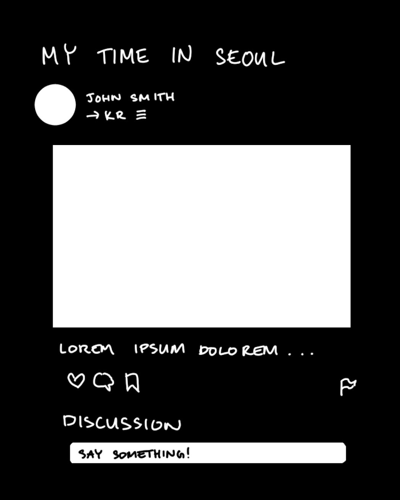

#

## Table of contents

* [Description](#description)
* [Goals](#goals)
* [Team](#team)

## Description

### Problem Statement

There are students who want to travel abroad, but have no prior experience, and there are students who have traveled abroad with lots of experience. These people don’t have a dedicated platform to interact with each other, leading prospective exchange students to have unrealistic perceptions of a given study abroad program.

### Our Solution

Our solution is a peer-to-peer study abroad experience sharing site which is an application designed for UH Manoa students to post about the experiences they had in traveling/studying in other countries. This enables and promotes student discussion on the topic of studying abroad.

### Concept Landing

The landing page is presented when viewres first enter the site and dispays images from student posts and a link to register or sign in.

### Concept Profile Page

The profile page displays the user's personal information as well as other social links. Other students have the option to follow each other though the follow button when signed in.

### Concept Sign Up Page

Users can use the Register Button on the right hand corner of the navbar to register for a new account. Students will need to enter their UH Manoa email and ID in order to create new posts.

### Concept Sign In Page 

To sign in, students can either use the link at the top of the navbar or in the Register page. 

### Concept Post Component

Students can post a picture to be shared with their followers. The post component consist of an image, likes, comments, saves, reports, tags, profile picture, and a comment section.

## Goals

Our aim is to make it easier for prospective study abroad students and former/current study abroad students to connect and share experiences with the ultimate goal of creating a realistic perception of UH Manoa's available exchange programs.

Create a site that allows users to:
- Register and sign into their account
- Have personal profile pages
- Create posts with images, descriptions, and tags
- Like, save, and reply to posts
- Report inappropriate posts and comments

Create a site that:
- Looks attractive and modern
- Is easy to navigate
- Allows special permissions for moderators

## Team

Manoa Exchange is designed, implemented, and maintained by [Kelly Sato](https://kelly-sato.github.io), [Richard Baltazar](https://RichardBzar.github.io), [Kayla-Marie Torres](https://kaylamarietorres.github.io), [Josiah Kila](https://josiahkila.github.io) and [Lauren Clayton](https://laurenjc.github.io/).
