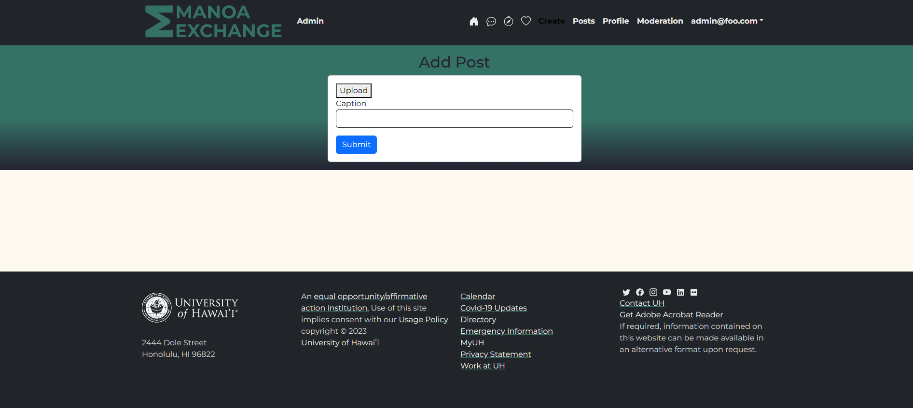
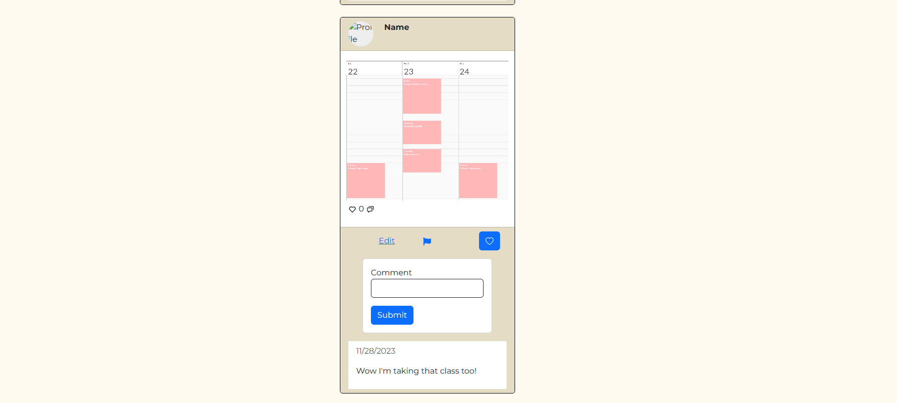
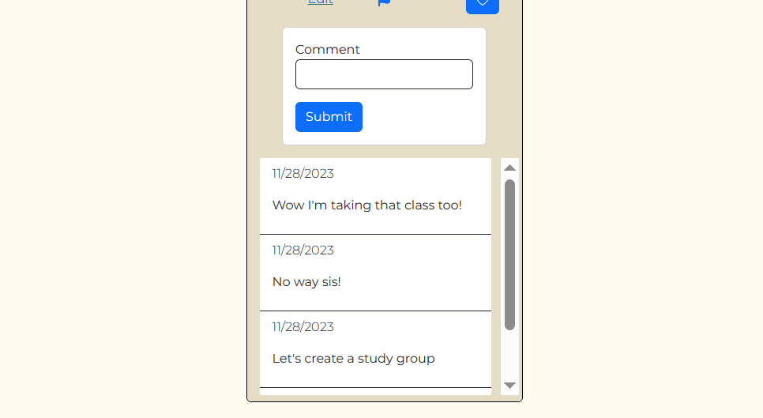
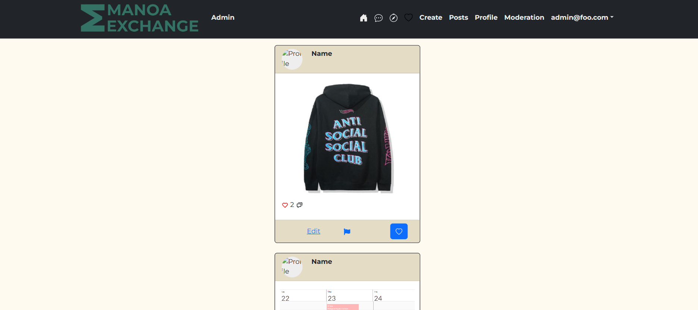
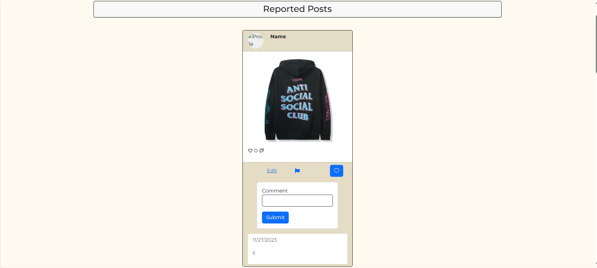

### Important Links 
* <a href = "https://github.com/manoa-exchange">Github Organization</a>
* <a href = "https://docs.google.com/document/d/1nteX543kMCYJGZ1wz_qUCjIUVHeU8d_F11VFqwEwwdI/edit">Team Contract</a>
*  <a href = "https://github.com/orgs/manoa-exchange/projects/1">M1 Project Page</a>
*  <a href ="https://github.com/orgs/manoa-exchange/projects/3/views/1">M2 Project page</a>
* <a href= "https://manoaexchange.com/">Digital Ocean</a>
* <a href = "https://docs.google.com/document/d/1nteX543kMCYJGZ1wz_qUCjIUVHeU8d_F11VFqwEwwdI/edit">Team Contract</a>

## Table of contents

* [Description](#description)
* [Goals](#goals)
* [Developmental Progress](#developmental-progress)
* [Deployment](#deployment)
* [Team](#team)

## Description

### Problem Statement

There are students who want to travel abroad, but have no prior experience, and there are students who have traveled abroad with lots of experience. These people don’t have a dedicated platform to interact with each other, leading prospective exchange students to have unrealistic perceptions of a given study abroad program.

### Our Solution

Our solution is a peer-to-peer study abroad experience sharing site which is an application designed for UH Manoa students to post about the experiences they had in traveling/studying in other countries. This enables and promotes student discussion on the topic of studying abroad.

### Concept Landing

The landing page is presented when users first enter the site. There are several links to the Sign Up page, and it lists the features of the application. Additionally, there will be a carousel of resources available at the bottom of the page.


### Concept Profile Page

The profile page displays the user's personal information as well as other social links. Other students have the option to follow each other though the follow button when signed in.


### Concept Sign Up Page

Users can use the Register Button on the right hand corner of the navbar to register for a new account. Students will need to enter their UH Manoa email and ID in order to create new posts.


### Concept Sign In Page 

To sign in, students can either use the link at the top of the navbar or in the Register page. 


### Add Post 


### Edit Post 


### Post Page

Students can post a picture to be shared with their followers. The post component consist of an image, captions, likes, comments, saves, reports, tags, profile picture, and a comment section.



### Comment Section



### Sign Out Page


### Saved Posts Page



### Moderation Page


## Goals

Our aim is to make it easier for prospective study abroad students and former/current study abroad students to connect and share experiences with the ultimate goal of creating a realistic perception of UH Manoa's available exchange programs.

Create a site that allows users to:
- Register and sign into their account
- Have personal profile pages
- Create posts with images, descriptions, and tags
- Like, save, and reply to posts
- Report inappropriate posts and comments

Create a site that:
- Looks attractive and modern
- Is easy to navigate
- Allows special permissions for moderators


## Installation Guide
 
 First, [install Meteor](https://www.meteor.com/install).

Second, visit the [Manoa Exchange application github page](https://github.com/manoa-exchange/manoa-exchange-meteor-app), and click the "Use this template" button to create your own repository initialized with a copy of this application. 

Third, cd into the Manoa Exchnage /app directory and install libraries with:

```
$ meteor npm install
```

```
$ npm install obscenity
```

```
$ npm install cloudinary
```


Fourth, run the system with:

```
$ meteor npm run start
```

If all goes well, the application will appear at [http://localhost:3000](http://localhost:3000).

## Continuous Integration


Manoa Exchange uses [GitHub Actions](https://github.com/manoa-exchange/manoa-exchange-meteor-app/actions/workflows/ci.yml) to automatically run ESLint and TestCafe each time a commit is made to the default branch.  You can see the results of all recent "workflows" at [https://github.com/manoa-exchange/manoa-exchange-meteor-app/actions](https://github.com/manoa-exchange/manoa-exchange-meteor-app/actions).


## Developmental Progress

[Milestone 1](https://github.com/orgs/manoa-exchange/projects/1)

For M1, we will largely be focusing on implementing a UI. We will also implement a Profiles collection to hold data related to each user profile.

[Milestone 2](https://github.com/orgs/manoa-exchange/projects/3/views/1)

M2 Project page showing the issues expected to be addressed during the second Milestone for this project. Implement admin page, signed in home page, post/profile components, add saved post component and improve styling.

[Milestone 3](https://github.com/orgs/manoa-exchange/projects/4)

M3 Project Page, showing issues to be addressed for our last Milestone for this project. We will continue to improve forms, implement adding images and filtering features in the home page.

## Deployment

We acquired the domain name manoaexchange.com and made it secure with an HTTPS.

[manoaexchange.com](https://manoaexchange.com)

## Team

<a href = "https://docs.google.com/document/d/1nteX543kMCYJGZ1wz_qUCjIUVHeU8d_F11VFqwEwwdI/edit">Team Contract</a>

Manoa Exchange is designed, implemented, and maintained by [Kelly Sato](https://kelly-sato.github.io), [Richard Baltazar](https://RichardBzar.github.io), [Kayla-Marie Torres](https://kaylamarietorres.github.io), [Josiah Kila](https://josiahkila.github.io) and [Lauren Clayton](https://laurenjc.github.io/).
